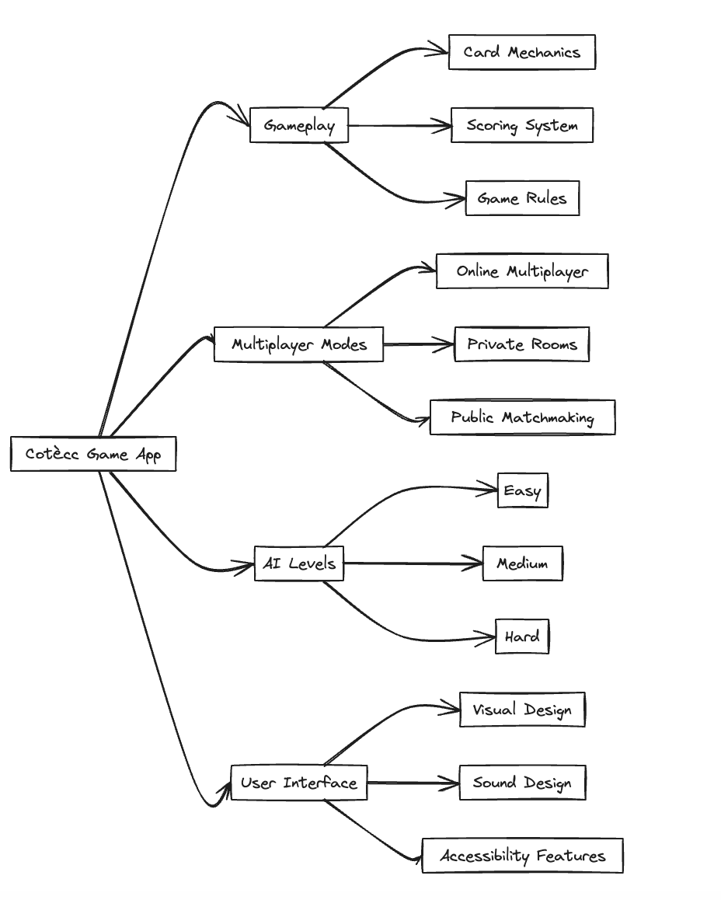

# Cotècc Game App

This repository contains the resources to develop a card game app:




## Game Rules

"Cotècc" is a card game played with Bergamasche cards, designed for 5 players, each receiving 7 cards while the rest remain out of play. The objective is to avoid taking cards. Players must respond to the played suit or receive a "bóla" (point). Accumulating 4 "bóle" results in elimination, but players can re-enter with a higher score by doubling the stake. After reducing to 4 players, two of the remaining cards are displayed as 'spies'. The card ranks are: Ace (highest), then 10 to 2. Points are as follows: Ace (6 points), 10 (5 points), 9 (4 points), 8 (3 points). The last hand awards an additional 6 points. The player with the highest score gets a "bóla"; in a tie, 2 "bóle" are assigned. A player taking all cards does a "capòt", reducing their score by one, while others increase by one. To avoid letting an opponent make a "capòt", at least one capture is needed, even with non-point cards. In a final tie with each player having 4 "bóle", all players re-enter for an elimination round.

https://it.m.wikipedia.org/wiki/Cotecchio#Regole_bergamasche

## Development

The app lives in [`CoteccApp/`](./CoteccApp) and is built with **Expo SDK 56**
(React Native 0.86 / React 19) using **Expo Router** for navigation. It is a
fully local, offline game — the web target is a **static** bundle (no server or
database). Native `android/`/`ios/` folders are not committed; they are
regenerated on demand via Continuous Native Generation (`expo prebuild`).

- Expo SDK 56 docs: https://docs.expo.dev/versions/v56.0.0

### Prerequisites

- **Node 22** (see [`.nvmrc`](./.nvmrc); run `nvm use`).
- For the native iOS/Android toolchain (Xcode, Android Studio, watchman, JDK),
  see [`doc/DEVELOPMENT.md`](./doc/DEVELOPMENT.md).

All commands below run from `CoteccApp/` unless noted otherwise.

### Install

```bash
cd CoteccApp
npm install
```

### Run (development)

```bash
npm run web -- --port 8090   # web in the browser (http://localhost:8090)
npm run ios                  # iOS simulator (requires Xcode)
npm run android              # Android emulator (requires Android Studio)
npm start                    # Expo dev server (choose platform)
```

### Quality checks

```bash
npm run lint                 # ESLint (eslint-config-expo)
npm test                     # Jest (jest-expo) with coverage
npx tsc --noEmit             # TypeScript type-check
```

### Build a static web bundle

```bash
npx expo export --platform web --output-dir dist
```

Produces a static SPA in `dist/` (served as-is by any static host / nginx).

### Regenerate native projects (CNG)

```bash
npx expo prebuild --clean    # regenerates android/ and ios/ from app.json
```

### Web Docker image

From the repository root:

```bash
docker compose build cotecc-web
docker compose up -d cotecc-web   # served at http://localhost:8080
docker compose down --volumes
```

### Screenshots

```bash
cd tools/screenshots
npm install
npx playwright install chromium
npm run capture                   # BASE_URL defaults to http://127.0.0.1:8090
npm run assert:web-render         # smoke-test that the web app renders (WEB_URL, default :8080)
```

### Native builds & releases (EAS)

Cross-platform builds run through [EAS](https://docs.expo.dev/build/introduction/)
for the Expo project `cotecc` (project id `daaed10d-d90d-4d15-ac51-3df291ff8e48`).
EAS pipeline setup is tracked separately.
