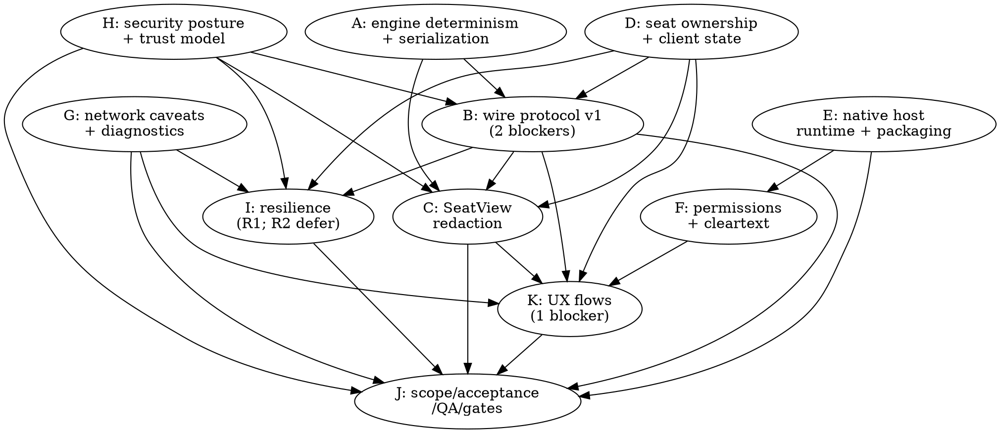

# Local Multiplayer Connectivity — Review Consolidation & v2 Plan

**Date:** 2026-06-20
**Status:** Planning (input = 12 reviewer files, 109 comments)
**Inputs:**
- Design v1: `2026-06-20-local-multiplayer-connectivity-design.md`
- Reviews: `*.review-comments.01..12-*.md` (+ `00-index`)

This document (a) consolidates the 109 review comments into a small number of
themes, (b) draws the **dependency graph** between them, (c) lists the objective
**factual corrections** the reviewers caught, (d) proposes the **v2 document
structure** (split per phase, as the volume warrants), mapping every theme to the
doc that resolves it, and (e) defines the **second review** that verifies the key
concerns were actually addressed.

---

## 1. Comment inventory

| Reviewer | IDs | Count | Blocking | High |
|---|---|---:|---:|---:|
| 01 architect | ARCH-001..010 | 10 | 1 | 6 |
| 02 product | PROD-001..007 | 7 | 0 | 4 |
| 03 game | GAME-001..008 | 8 | 0 | 5 |
| 04 network | NET-001..014 | 14 | 0 | 4 |
| 05 expo/RN | EXPO-001..007 | 7 | 0 | 3 |
| 06 frontend | FE-001..007 | 7 | 0 | 5 |
| 07 websocket | WS-001..009 | 9 | 0 | 3 |
| 08 api | API-001..008 | 8 | 1 | 4 |
| 09 security | SEC-001..009 | 9 | 0 | 5 |
| 10 qa | QA-001..010 | 10 | 1 | 5 |
| 11 build | BUILD-001..008 | 8 | 0 | 4 |
| 12 ui/ux | UX-001..012 | 12 | 1 | 7 |
| **Total** | | **109** | **4** | **55** |

**The 4 blocking comments** (must be resolved in v2): `ARCH-002` (protocol seam too
thin), `API-001` (no canonical wire envelope), `QA-001` (phase outcomes not pass/fail),
`UX-003` (zero-infra short room-code cannot resolve a host address).

The single loudest signal: **the v1 doc overstated how network-ready the engine is
and never specified the actual contracts** (protocol envelope, redacted view, seat
model). Six reviewers independently said the same thing.

---

## 2. Consolidated themes (clusters)

Each cluster groups comments by the work that resolves them. Cross-listed IDs note
their secondary cluster.

### A — Engine determinism & serialization *(foundation)*
The engine deals with `Math.random`, mutates in place, stores duplicate card
references in `cards` + `cardsBySuit`, and embeds a `Set` in `RoundResult` (not
JSON-safe). Replay/reconnect/snapshots need a canonical dealt state, a seeded/
canonical deal, typed command results, a `WireGameState` codec (Set→array,
numeric map-key normalisation), a snapshot hydrator, and value-based card identity.
- **Comments:** ARCH-001, GAME-001, GAME-005, WS-003, API-006(→B).

### B — Wire/protocol contract *(foundation; contains 2 blockers)*
No envelope, ids, versioning, ack/reject, idempotency, ordering, or lifecycle.
Need: discriminated JSON message union; envelope (`protocolVersion`, `sessionId`/
`matchId`, `seatId`, `seatToken`, `clientMessageId`/`commandId`, `serverSeq`,
`stateVersion`, `sentAt`); session lifecycle state machine (join→seat→lobby→
in_game→reconnecting→left); command `Ack`/`Reject` with stable error codes;
per-seat monotonic seq + host de-dup; setup & round-transition events
(`ConfigureTable`/`StartRound`/`RoundComplete`/`RequestNextRound`); `CardRef`
`{suit,rank}` with host-derived points; transport **capability** interfaces
(`HostEndpoint`/`ClientConnection`) so WS/SSE/BLE/loopback map cleanly; SSE+POST
semantic parity; `protocol.ts` + golden fixtures + compat tests.
- **Comments:** ARCH-002🚫, ARCH-010, GAME-002, GAME-004, WS-001, WS-002, WS-007,
  WS-008, API-001🚫, API-002, API-003, API-004, API-007, API-008, SEC-002(→H),
  SEC-003(→H).

### C — Redaction / `SeatView` schema *(foundation; security-critical)*
Redaction is recommended but not a schema or a test oracle. Define
`SeatView`/`PublicTableView` allowlist (localSeatId, localHand, per-seat public
`cardCount`, current trick, past tricks, scores, lives, connection/control flags);
forbid sending `GameState`/`players[].cards`/`cardsBySuit`/`pastRounds`/debug;
add snapshot tests per outbound message type.
- **Comments:** ARCH-004, GAME-003, FE-003, API-005, SEC-004, QA-005.

### D — Seat ownership & client state model *(foundation)*
v1 is coupled to the single-`isHuman` local model (`GameScreen`/`HomeScreen`).
Need a seat model: `localSeatId`, seat assignment, controller mode
(`local|remote|ai`), connection state (`connected|grace|disconnected`), reclaim
token, timeout policy; a client-side state machine.
- **Comments:** ARCH-003, ARCH-009(→I), GAME-006, FE-002, FE-004, WS-005.

### E — Native host runtime & packaging *(Phase 1 enabler; highest delivery risk)*
The embedded HTTP+WS host is a full native-runtime + packaging concern, not a
module choice. Need: SDK56/RN0.85-compatible server lib or an Expo Module + config
plugin; `expo prebuild --clean` as acceptance; web-export packaging (`expo export
--platform web` → bundled asset, MIME/SPA fallback, hash manifest, EAS-Update-vs-
binary decision); `eas.json` dev/preview + `runtimeVersion`; binary-size budget;
dev-client workflow; native CI gate; **a real-device spike proving serve+WS on iOS
and Android.**
- **Comments:** ARCH-006, NET-012(→I), EXPO-001, EXPO-002(→I), EXPO-004, EXPO-007,
  FE-006, WS-004, QA-007, BUILD-001, BUILD-002, BUILD-004, BUILD-005(→J),
  BUILD-006, BUILD-007, BUILD-008.

### F — Permissions & cleartext policy *(Phase 1 enabler)*
iOS `NSLocalNetworkUsageDescription` + `NSBonjourServices` + ATS; Android cleartext
network-security-config + `INTERNET` + `NEARBY_WIFI_DEVICES`/location for hotspot;
`expo-camera` + `NSCameraUsageDescription` for in-app QR; permission UX matrix
(pre-prompt, denial, settings, fallback).
- **Comments:** NET-003, EXPO-003, EXPO-005, EXPO-006, BUILD-003, UX-004.

### G — Network-reality caveats & diagnostics
Correct overstatements (see §3) and replace coarse "isolation" inference with a
**local-only** diagnostic ladder (`/healthz` fetch → WS-upgrade timeout categories
→ host-side "guest seen" → permission status → gateway/captive check) that does
**not** rely on internet reachability (offline LANs are valid). Add a failure
taxonomy → user-facing recovery.
- **Comments:** ARCH-008, NET-001(→F,K), NET-002(→F), NET-004, NET-005, NET-006,
  NET-007, NET-008, NET-009, NET-010(→K), NET-011, NET-013(→I), NET-014, FE-005,
  WS-009, QA-008, UX-005(→K).

### H — Security posture & trust boundaries
State the LAN attacker model explicitly: Phase 1 = cooperative/trusted networks,
no confidentiality/integrity on hostile LANs. Bind seat→connection (ignore
client-sent seat ids); token lifecycle (separate admission vs per-seat resume
tokens, high entropy, rotation, single active connection, reclaim confirmation);
enforceable redaction (→C); host-migration privacy (→I); clarify F2 audit trail
does not stop a malicious host (anti-host begins at F3 / intermediate commit-reveal);
QR credential leakage rules; embedded-server hardening (bind LAN iface, random
port, asset allowlist, no dir listing, size/rate/connection caps); mDNS metadata
minimisation.
- **Comments:** ARCH-007, SEC-001, SEC-002(→B), SEC-003(→B), SEC-005(→I), SEC-006,
  SEC-007(→K), SEC-008, SEC-009.

### I — Resilience scoping (reconnect / AI takeover / host migration)
R1 needs the seat-controller model (→D) + heartbeat cadence/timeout/half-open +
pause-vs-AI **default** (product decision) + reconnect snapshot + stale-command
rejection + a minimal monotonic `stateVersion` already in Phase 1. R2 host
migration conflicts with hidden-state privacy → trusted hot-standby/co-host **or
defer** (mirror only the public log; host-loss ends the match under F1); browser
clients have an origin problem on migration. F3 trustless split into tamper-evident
(commit-reveal) vs host-private (mental poker).
- **Comments:** ARCH-005, ARCH-009(→D), GAME-006(→D), GAME-007, GAME-008(→future),
  NET-013, EXPO-002, WS-006, SEC-005, PROD-006, UX-006, UX-007, QA-006.

### J — Product scope, phasing, acceptance & gates
Split Phase 1 into **1A LAN MVP** and **1B robustness**. Add measurable per-phase
acceptance criteria (Given/When/Then), a Phase 1 platform matrix (Android/iOS host;
Android/iOS/browser guests; ≥1 mixed 4-player), a QA test matrix, a device & network
lab, an automation plan (Jest + Playwright), an offline-play regression checklist,
release gates incl. native build, and decision triggers for Phase 3/4. Tie iOS host
availability to distribution reality (dev-client alpha vs TestFlight/EAS).
- **Comments:** PROD-001, PROD-002, PROD-003, PROD-005, PROD-007, QA-001🚫, QA-002,
  QA-003, QA-004, QA-009, QA-010, BUILD-005.

### K — UX flows & player-facing model *(contains 1 blocker)*
Host/guest screen-by-screen journey; pairing descriptor (QR payload, optional Wi-Fi
QR, two-step rule, expiry/refresh, visible SSID/IP/port); manual fallback that
carries the full address (no zero-infra lookup); `/join?room=&seatToken=` route
(Expo Router parsing, SPA fallback for `/join` & `/game`); role model
(host=owner/referee/dealer, guests=seat owners) + control matrix; lobby/seating
contract (2–6 seats, bots, ready, late join/rejoin); command-state UX table;
error-state table; reconnection & host-loss UX; accessibility (manual/keyboard/
screen-reader/non-color status); custom-scheme vs universal-link split; browser
guest onboarding that bypasses local-only setup.
- **Comments:** PROD-004, FE-001, FE-007, UX-001, UX-002, UX-003🚫, UX-008, UX-009,
  UX-010, UX-011, UX-012.

---

## 3. Objective factual corrections for the v1 master doc

These are not opinions — the reviewers caught claims that are wrong as written.
v2 must fix each:

1. Engine is **not** a directly-serializable pure reducer: `Math.random` deal,
   in-place mutation, `Set` in `RoundResult`, duplicated card refs. (ARCH-001,
   GAME-001/005, WS-003)
2. "Reuses the existing web bundle **verbatim**" → reuses the same static artifact
   **after** adding the join/client flow. (FE-002)
3. "Requires same **subnet**" → requires routable reachability; subnet/multicast is
   mainly an mDNS requirement. (NET-005)
4. "**Any** IP transport works" → TCP/WS is the primary target; UDP/WebRTC/mDNS need
   separate validation. (NET-006)
5. WebRTC "works across subnets/NAT **with STUN**" → *may*; restrictive NAT/firewall
   needs **TURN** (infra). (NET-007)
6. Hotspot "guests **auto-join**" → guided OS Wi-Fi join; generally a **two-step**
   (Wi-Fi QR, then game URL/QR). (NET-001, EXPO-005)
7. Isolation detection via **internet/gateway** reachability → invalid: offline LANs
   are legitimate; use local-only probes. (ARCH-008, NET-004)
8. Manual "**short code maps to host IP:port**" → impossible with zero infra; the
   fallback must carry the full `http://<ip>:<port>` + token. (NET-010, UX-003 🚫)
9. SSE+POST "fallback for restrictive networks" → only mitigates WS-upgrade/proxy
   issues **after** HTTP reachability is proven; does not fix isolation. (NET-008)
10. "`GameState` serialises directly to JSON" → false (see #1). (WS-003)
11. Universal/app links presented as zero-infra → require an HTTPS domain; split
    from offline custom-scheme links. (FE-007)

---

## 4. Dependency graph

**Critical path:** `A + D → B → C → (E,K) → I → J`. Nothing about transports,
reconnection, or UX can be specified correctly until **A (engine), D (seats),
B (protocol), C (redaction)** exist. `E` (native host) is an independent
high-risk track that should spike in parallel.

**Build order (layers):**
- **L0 (editorial):** apply §3 corrections; add H posture & K role model to master.
- **L1 (Phase 0 contracts):** A, D, then B, C.
- **L2 (Phase 1A):** E (+F), realise minimal B/C/D, K host/guest journey, 1A acceptance (J subset).
- **L3 (Phase 1B):** G diagnostics, I (R1), H hardening, K error/reconnect/host-loss UX, full J (matrix/lab/automation/gates).
- **L4 (future, gated):** I→R2 migration, F3 trustless, Tier-2 WebRTC, native transports — each behind a decision trigger (PROD-007).

---

## 5. v2 document structure

The volume justifies splitting per the brainstorming guidance. Proposed set
(naming keeps the `2026-06-20-local-multiplayer-*` family):

| # | File | Role | Resolves clusters | Key comment IDs |
|---|---|---|---|---|
| M | `...connectivity-design.md` *(revise in place → v2)* | Overview, decision-record, corrected facts, security posture, trust/role model, phase map, future+triggers | §3 fixes, G(facts), H(posture), J(phasing overview), K(role model) | NET-005/006/007/010, FE-002/007, ARCH-007/008, SEC-001, PROD-001/002/007 |
| F0 | `2026-06-20-local-multiplayer-foundations-design.md` *(new)* | Phase 0 contracts: engine hardening, seat model, **wire protocol v1**, **SeatView** | A, D, B, C | ARCH-001/002/003/004/009/010, GAME-001..006, WS-001/002/003/005/007/008, API-001..008, SEC-002/003/004, FE-002/003/004, QA-005 |
| 1A | `2026-06-20-local-multiplayer-phase1a-lan-mvp-design.md` *(new)* | Native host spike+packaging, permissions/cleartext, static-serving contract, host/guest journey + join route + lobby, minimal reconnect/stateVersion, 1A acceptance + QA subset | E, F, K(core), J(1A) | ARCH-006, EXPO-001/003/004/005/006/007, BUILD-001..008, WS-004, FE-001/005/006, UX-001/002/003/004/008/009/010, QA-001/007 |
| 1B | `2026-06-20-local-multiplayer-phase1b-robustness-design.md` *(new)* | Diagnostics ladder + failure taxonomy + hotspot/isolation fallback, R1 reconnect/AI/heartbeat, security hardening, error/reconnect/host-loss UX, SSE+POST parity, mDNS, full QA/lab/automation/gates | G, I(R1), H(hardening), K(errors), J(1B) | NET-001/002/004/008/009/011/012/013/014, ARCH-005/008, WS-006/009, EXPO-002, SEC-005/006/007/008/009, PROD-006, UX-005/006/007/011/012, QA-002/003/004/006/008/009/010 |

**Future/deferred** (a short section in M, not its own spec yet): R2 host migration
(trusted-successor vs defer), F3 trustless deal (commit-reveal vs mental poker),
Tier-2 WebRTC browser hosting, native transports (Wi-Fi Direct / Multipeer /
Nearby / BLE) — each with a PROD-007 decision trigger. (GAME-007/008, ARCH-005,
NET-007/011/013, SEC-005/006, PROD-007)

**Traceability rule for v2:** each new/edited section cites the comment IDs it
resolves, so the second review can check coverage mechanically.

---

## 6. Open decisions that block a *correct* v2

These need the maintainer; v2 cannot be written accurately without them:

1. **Dropped-seat default** (PROD-006/I): pause the table, or AI-take-over after N
   seconds? Changes fairness, protocol, and UX.
2. **Security target for v1** (H/SEC-001): is "cooperative/trusted LAN only, no
   confidentiality, anti-host cheating deferred to F3" an acceptable explicit stance?
3. **iOS host distribution** (PROD-005/EXPO-007): ship Android-first alpha with
   dev-client-only iOS hosting, or gate Phase 1 GA on TestFlight/EAS signed builds?
4. **Host-served payload** (BUILD-008): serve the full app bundle, or build a slimmer
   dedicated "join client" web export to control APK/IPA size?
5. **v2 structure** (§5): confirm the master + 3 sub-specs split (vs one large doc).
6. **R2 host migration**: design a trusted-successor model now, or defer with
   "host-loss ends match" for Phase 1?

---

## 7. Second-review plan (verify key concerns addressed)

After v2 is written:

1. **Focused re-review**, not all 12. Re-dispatch the reviewers whose
   blocking/high concerns drove v2: **architect, api/protocol, security, game,
   expo/RN, network, qa, ui/ux** (8 agents). Each receives its **own prior comment
   file** + the relevant v2 docs and returns, per prior comment ID, a verdict:
   `resolved | partially | not-addressed | won't-fix(rationale)`, plus any *new*
   issues introduced by v2.
2. **Naming:** `2026-06-20-local-multiplayer-connectivity-design.review2-comments.
   <NN>-<agent>.md`; new comment IDs `LMCD-RC2-<NN>-<ROLE>-<SEQ>`; a `review2`
   index with a coverage table (every v1 ID → status).
3. **Exit criteria:** all 4 blockers `resolved`; all `high` either `resolved` or
   explicitly deferred-with-rationale in M's future section; no new blocking issues.
4. If exit criteria fail, iterate v2 in place and re-run only the affected
   reviewers.

---

## 8. Immediate next steps
1. Maintainer answers §6 open decisions.
2. Write v2 in dependency order (L0→L3): master corrections → F0 contracts → 1A → 1B.
3. Self-review v2 for placeholders/consistency/coverage of all 109 IDs.
4. Run the §7 second review; iterate to exit criteria.
